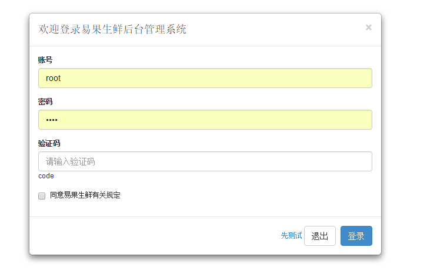
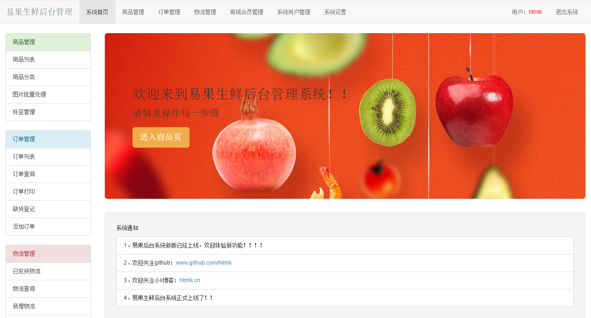
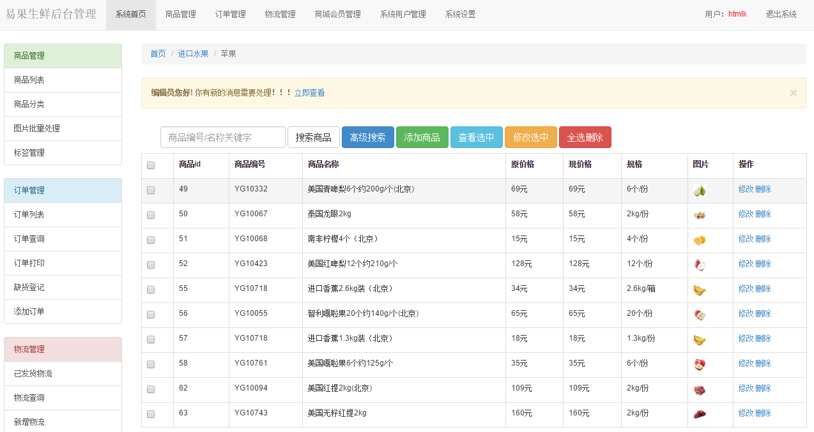
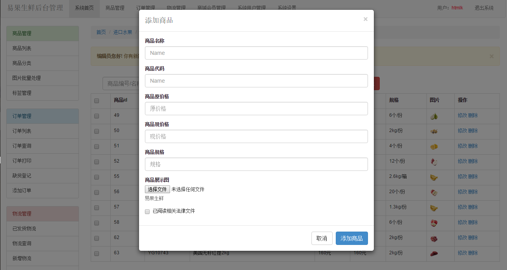
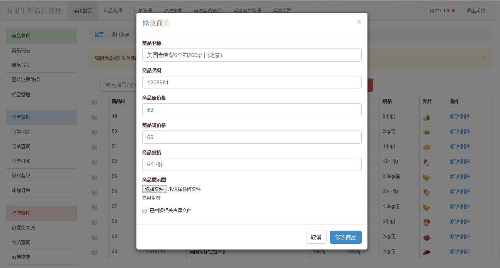

# angular+bootstrap商城后台管理项目
## 1.安装环境
### 前端页面环境(web service)
本人使用的是fekit，当让你也可以使用apache，nginx等服务启动

    fekit server

### 后台环境（node+express+mysql）

详情请看：[node+express+mysql](https://github.com/htmlk/express)

数据库已经打包到本项目mysqlangular.sql

### 2.项目展示

1.登录页面

    账号：htmlk
    密码：htmlk

2.主页（点击进入商品页）

3.商品展示页（可进行搜索操作，点击添加可添加上平，点击删除可以删除商品）

4.添加商品页

5.修改商品页

